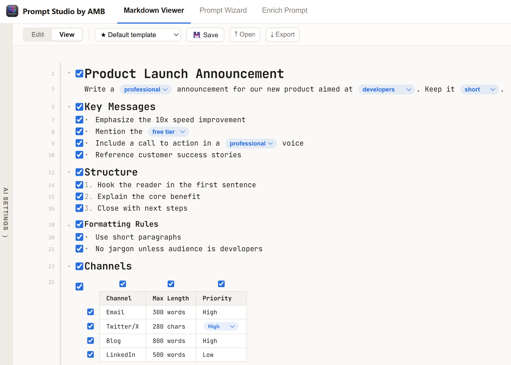
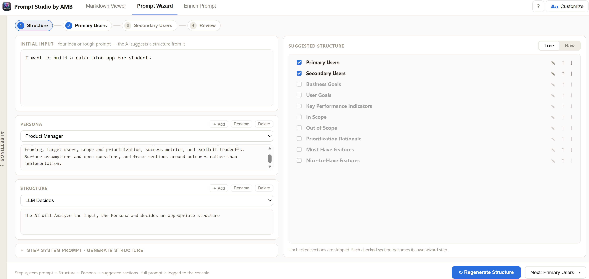
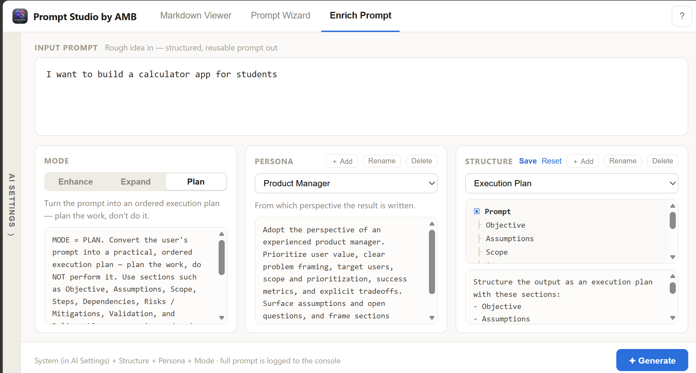
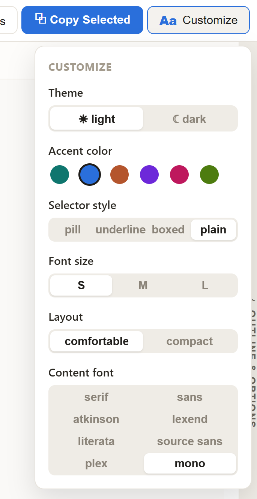

# Prompt Studio

Write better prompts, faster — without leaving VSCode. Prompt Studio treats a prompt as a living markdown document with **inline options**: the choices you'd normally rewrite by hand (tone, audience, length, format…) become clickable switches, so one prompt adapts to many situations.

## The approach: options, not rewrites

A good prompt is full of deliberate decisions. Instead of baking one decision in, Prompt Studio writes them as inline options using markdown link syntax — e.g. `casual` vs `formal`, each tagged as an option — right inside the markdown. Flip an option and the whole prompt updates. Save it, reuse it, share it. The AI tools below don't just generate text; they generate *option-rich* prompts you keep steering.

## Three tools, one studio

### 📄 Markdown Viewer
A clean reader for any `.md` file that understands inline options. Open a prompt, toggle its options, and copy the resolved text — exactly what you'll paste into your AI chat. Great for browsing and reusing a personal prompt library.

### 🪄 Prompt Wizard
Builds a full prompt from a rough idea, step by step:
1. **Structure** — the wizard proposes the sections your prompt needs; keep, reorder, or drop them.
2. **Sections** — generate each section one at a time, with a per-section persona, length, and extra instructions. Regenerate with feedback until it's right.
3. **Review** — see the assembled prompt and open it in the viewer.

You stay in control at every step — the wizard drafts, you decide.

### ✦ Enrich Prompt
Paste a rough prompt and get a clear, well-structured, reusable one back — with the uncertain parts expressed as inline options instead of invented facts.

## The dials: Mode, Persona, Structure

Every AI generation is shaped by three dials you set (and can fully edit):

- **Mode** — how far the AI goes:
  - **Enhance** — clarify and restructure without changing scope.
  - **Expand** — go exactly one level deeper; make the implicit explicit.
  - **Plan** — turn the prompt into an ordered execution plan (plan the work, don't do it).
- **Persona** — the perspective the result is written from: Product Manager, Senior Software Engineer, Technical Writer, UX Designer, Data Scientist — or none. Add, rename, and save your own personas; edits persist in your library.
- **Structure** — the section skeleton of the output: Standard (Role / Rules / Context / Input / Output), Minimal, or your own custom structures.

Bring your own AI provider (including local Ollama). Your API key is stored in the OS keychain via VSCode SecretStorage and never leaves your machine except to call the provider you chose.

## Make it yours

Light or dark theme, accent color, option selector style, font, and layout density — all in the Customize panel.

## Using it in VSCode
- `Cmd/Ctrl+Shift+P` → **Prompt Studio by AMB: Open**
- Click the Prompt Studio icon in any `.md` editor title bar
- Right-click a `.md` file in the Explorer → **Open in Prompt Studio by AMB**

Prompts, settings, and wizard progress persist across sessions. Open and export use native file dialogs; exports write straight to your workspace.

